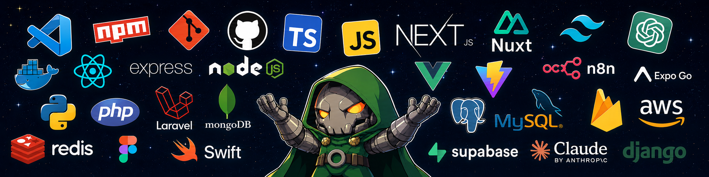

 

---

# Hi, I'm Mhar Jade 

### Building web, mobile, and AI-powered tools that make everyday life a little easier

 

### About Me

I'm a full-stack developer based in Tubod, Surigao del Norte, Philippines. Since 2022 I've shipped **10 production systems** for universities, local government units, and small businesses — while finishing my BSIT degree (graduating 2026).

-  Most recently built **CharlieBot**, an AI citizen-assistance chatbot fine-tuned for **Surigaonon**, a low-resource Philippine language — deployed as a full RAG system for a local government client
-  Full-stack across frontend (React, Vue), backend (Node.js, Laravel, Django), and mobile (Flutter, React Native)
-  Also work in applied AI & automation — RAG pipelines, Hugging Face, n8n workflows
-  BSIT, Surigao del Norte State University (2021–2026)
-  Certified: *Claude Code in Action* — Anthropic Education (2026)

 

### 🛠️ Tech Stack

**Frontend**

**Backend**

**Mobile**

**Database & AI**

**Tools & DevOps**

 

### 🚀 Featured Projects

<table>
<tr>
<td width="50%" valign="top">

**[CharlieBot](https://github.com/Ruruu18/CharlieBot-)**
 
AI citizen-assistance chatbot for a low-resource Philippine language. Deployed to 600+ citizens across 35 departments and 21 LGU services at 97% response accuracy.

</td>
<td width="50%" valign="top">

**[Smart Parking](https://github.com/Ruruu18/Smart-Parking)**
 
QR-based smart parking system with a real-time dashboard. Cut entry/exit time by 70% and replaced four hours of daily paperwork with a 10-minute review.

</td>
</tr>
<tr>
<td width="50%" valign="top">

**[SNSU iReserve](https://github.com/Ruruu18/snsu-ireserve-management-system)**
 
Facility & equipment scheduling system with conflict detection and multi-level approvals — cut approval time from three days to under four hours.

</td>
<td width="50%" valign="top">

**[Luna Certsys](https://github.com/Ruruu18/Luna-Certsys)**
 
Certification request system built for streamlined document processing and approvals.

</td>
</tr>
</table>

 

### 🌐 Connect With Me

  
  
  

 

  Thanks for stopping by — always open to interesting builds. ⭐

